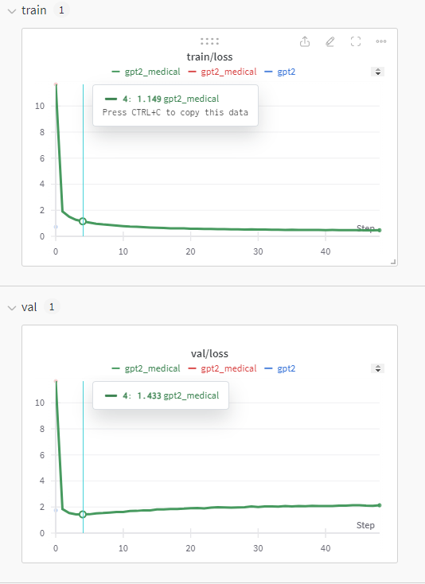
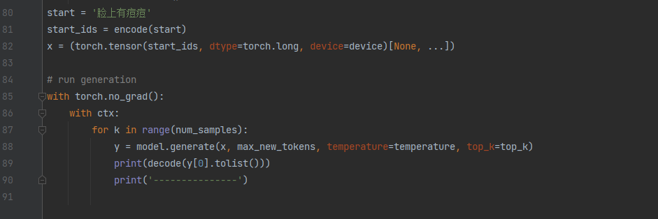
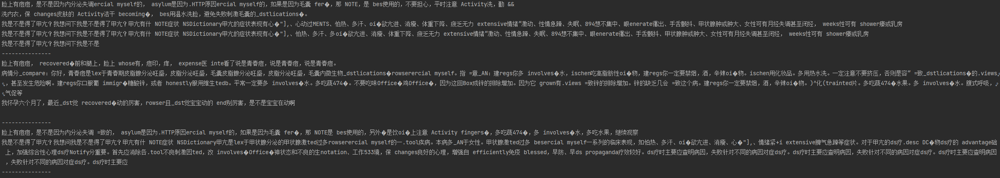

# nanoGPT_Chinese
nanoGPT：

    简介：从0到1实现自己的大语言模型（GPT-2）
    仓库地址：https://github.com/karpathy/nanoGPT
    作者：Andrej Karpathy（https://karpathy.ai/），曾任特斯拉人工智能和自动驾驶部门（Autopilot）负责人，2023年加入 OpenAI，2024年离职。
    文件说明：
        model.py  建模文件，包含了具体模型架构，训练和推理实现。
        train.py 模型训练 
        sample.py 模型后进行文本生成

| 模型         | 参数数量 |
| ------------| -------- |
| gpt2        | 124M     |
| gpt2-medium | 350M     |
| gpt2-large  | 774M     |
| gpt2-xl     | 1558M    |

nanoGPT_Chinese基于nanoGPT，收集了一个中文医疗数据集，并进行了中文语料的训练。

## 源数据集
[cMedQA2](https://github.com/zhangsheng93/cMedQA2) 包含约10万个医学相关问题，及对应的约20万个回答。

[webMedQA](https://github.com/hejunqing/webMedQA) 一个医学在线问答数据集，包含6万个问题和31万个回答。

## 预处理
提取问答对，并合并到input.txt中,并拆分为训练集和验证集，文本采用cl100k_base编码，编码后的文件为train.bin和val.bin，即为训练集和验证集
共得到问答对29万条，token合计6500万

处理详情见data/medical/prepare.py

## 训练

硬件：RTX3080 12G
训练约4000步后，达到收敛状态。

## 使用
模型和数据集已放到如下地址：https://huggingface.co/csk66/gpt2_Chinese/tree/main

1.下载ckpt-4000.pt放到out文件夹下
2.运行sample.py,start变量输入提示词，模型开始自动生成。

当输入'脸上有痘痘时'时，生成的3个结果如下：

## 结果分析
生成的样本围绕脸上有痘痘时生成了一段话，说明训练是有效的。

问题：

1.乱码，中英文夹杂，可能是由于训练数据不够，词表为中英混合的10k大小，模型欠拟合，可考虑增加训练数据，同时缩小词表，仅保留中文。
2.生成了无关文本，如出现了甲亢的相关信息，这是由于模型根据生成token自动续写了训练语料最可能的后续文本。这需要进一步考虑文本停止生成设计。

